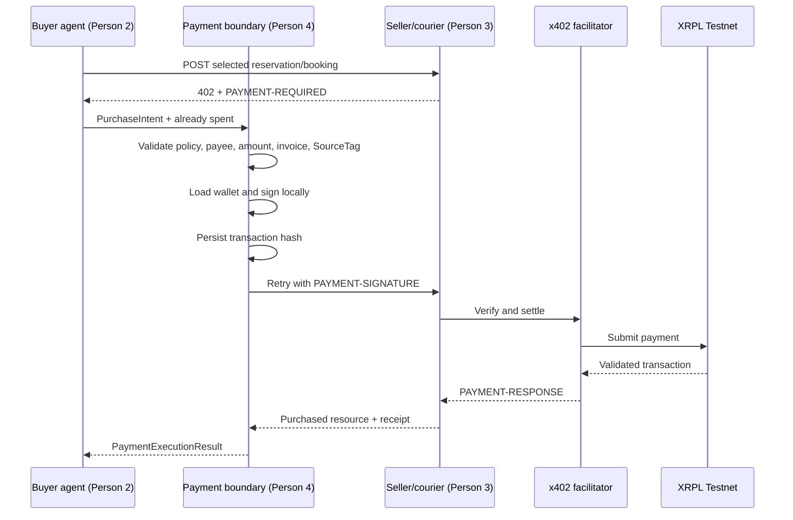

# Person 4 Payment Boundary Handoff

Status: **standalone Testnet payment proven; ready for teammate integration**

The payment package is deliberately independent of the buyer agent and provider
implementations. Person 2 and Person 3 can integrate against its public API
without editing files owned by Person 4.

## What is complete

- Reproducible Python 3.11 dependency lock with `xrpl-py` and `x402-xrpl`
- Testnet-only XRP configuration
- Strict XRPL address validation
- Deterministic wallet-policy and exact x402 requirement matching
- Safe wallet loading at the signing boundary
- Buyer-side `x402_purchase` executor
- Durable invoice/idempotency journal
- Transaction hash persistence before the paid HTTP retry
- Settlement receipt validation and normalization
- Provider-side `require_payment` middleware adapter
- Trusted request-scoped seller and courier pricing
- Persistent provider invoice store
- Permanent invoice binding to the exact provider request fingerprint
- Idempotent replay of paid provider responses without another settlement
- XRPL transaction-status lookup for reconciliation
- Standalone FastAPI paid-resource example
- Offline end-to-end commercial-loop test with no ledger writes
- Validated standalone x402 payment on XRPL Testnet with value delivery

## Payment sequence



## Person 2 integration

Person 2 produces the frozen `PurchaseIntent` shape after the AI has selected a
provider. The LLM must not create payment headers or see the wallet seed.

```python
from surplusflow_payments import PaymentExecutor, PaymentJournal, PaymentSettings
from surplusflow_payments.models import PurchaseIntent

settings = PaymentSettings()
journal = PaymentJournal(settings.payment_journal_path)
executor = PaymentExecutor(settings, journal)

intent = PurchaseIntent.model_validate(agent_purchase_intent)
result = executor.execute(intent, already_spent_drops=run_spend_drops)
```

Handle these public failures:

- `PolicyViolation`: the proposed payment was outside delegated authority.
- `DuplicatePaymentError`: it was already settled or identity fields were reused.
- `PaymentInProgressError`: do not retry; reconcile the stored hash/status.
- `PaymentExecutionError`: no signed hash means the same intent may be retried.
- `PaymentReceiptError`: treat a post-signature outcome as uncertain and reconcile.

For local fixture-only work, Person 2 can mock `PaymentExecutor.execute` to return
the frozen payment-receipt fixture. Real XRPL addresses from ignored environment
configuration must replace the deliberately synthetic contract addresses before
constructing the runtime `PurchaseIntent`.

## Person 3 integration

Person 3 adds middleware to each seller or courier FastAPI app. Seller
reservations and courier quotes use **trusted request-scoped pricing** because
the same endpoint can receive different quantities or quote IDs. The resolver
must read authoritative provider data; it must never return the
`PurchaseIntent.amountDrops` supplied by the buyer.

```python
from surplusflow_payments import (
    ProviderPaymentConfig,
    ProviderPricingError,
    ProviderRequestContext,
    PurchaseIntent,
    SQLiteInvoiceStore,
    SQLiteProviderResponseStore,
    install_provider_payment,
)


def resolve_seller_price(context: ProviderRequestContext) -> int:
    intent = PurchaseIntent.model_validate(context.payload)
    offer = load_offer_from_provider_database(intent.resource_id)
    if offer is None or offer.seller_id != intent.provider_id:
        raise ProviderPricingError(
            "Offer does not exist for this seller",
            error="not_found",
            status_code=404,
        )
    if intent.quantity is None or intent.quantity > offer.quantity_available:
        raise ProviderPricingError(
            "Requested quantity is unavailable",
            error="offer_sold_out",
            status_code=409,
        )
    return intent.quantity * int(offer.unit_price_drops)


payment_config = ProviderPaymentConfig(
    protected_paths="/api/sellers/seller_bakery_001/offers/offer_001/reserve",
    pay_to_address=settings.xrpl_bakery_pay_to,
    facilitator_url=settings.xrpl_facilitator_url,
)

install_provider_payment(
    app,
    payment_config,
    SQLiteInvoiceStore(".data/x402-invoices.sqlite3"),
    SQLiteProviderResponseStore(".data/provider-responses.sqlite3"),
    price_resolver=resolve_seller_price,
)
```

Courier services use the same pattern, but their resolver loads the selected
unexpired quote by `PurchaseIntent.resourceId` and returns its stored
`priceDrops`. Endpoints whose price is genuinely constant may instead set
`ProviderPaymentConfig.price_drops` and omit `price_resolver`; the two pricing
modes are mutually exclusive.

The SDK middleware owns `PAYMENT-REQUIRED`, `PAYMENT-SIGNATURE`, facilitator
verification, settlement, and `PAYMENT-RESPONSE`. The route handler must still
perform an atomic inventory/capacity lock and honor the same `Idempotency-Key`.
It returns the reservation or booking only after the middleware confirms payment.
Remove the temporary payment stub and all route-owned 402/header/facilitator
logic; `install_provider_payment` is the only payment protocol owner.
The complete installer recalculates the trusted price before challenge and
settlement, verifies the buyer's `amountDrops`, payee, network, and asset against
those terms, permanently binds the x402 invoice to the exact request fingerprint,
and caches the paid response outside the settlement middleware. Therefore a
changed quantity or quote cannot reuse a payment challenge, while a lost paid
HTTP response can be retried without paying twice.

## Verification commands

From the repository root:

```text
make doctor-person4
make test-person4
make run-payment-provider
```

The standalone provider returns HTTP 402 without a signature. Tests never fund,
sign, or submit a live ledger transaction.

After configuring ignored Testnet wallet variables, this read-only command checks
validated public balances without signing:

```text
cd packages/payments
uv run python examples/check_testnet_readiness.py \
  --provider-env XRPL_BAKERY_PAY_TO
```

## Validated standalone payment

The live proof was completed on XRPL Testnet on 2026-09-05:

- Transaction: `77766F4E2E4B1AD39D7EA21F7188E3D8615886110D6676570F1F9949C8A0E173`
- Result: `tesSUCCESS`, validated in ledger `20495875`
- Amount: `10000` drops (0.01 Test XRP)
- Payer: `rPfP2WTVS3EzK7TsiZWsKmTjSUBiJetJeD`
- Payee: `rHcvgpr6rEK97qpXPYYGURCqsiTDJA25jW`
- Value delivered: confirmed exclusive demo food reservation
- Explorer: <https://testnet.xrpl.org/transactions/77766F4E2E4B1AD39D7EA21F7188E3D8615886110D6676570F1F9949C8A0E173>

This was a provider-issued HTTP 402 challenge followed by a locally signed
`PAYMENT-SIGNATURE`, facilitator settlement, a validated XRPL transaction, and
the provider's paid response. Faucet funding is not being used as the commercial
transaction proof.

## Remaining live/integration gates

The standalone live-payment gates are complete. The remaining work depends on
teammate service implementations:

1. Connect Person 3's atomic inventory lock behind the provider middleware.
2. Connect Person 2's state machine to the executor and reconciliation path.
3. Add Docker Compose commands after all service entry points are known.
4. Replace the completed offline payment E2E fakes with teammate services and
   expose real explorer links to Person 1.

Never commit wallet seeds or a populated `.env` file. A signed or uncertain
invoice must be reconciled; it must not be automatically paid again.
