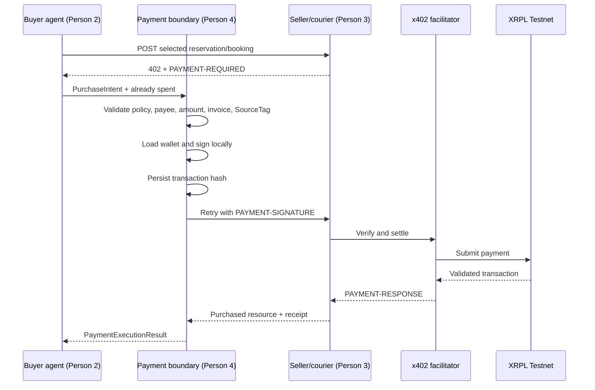

# Person 4 Payment Boundary Handoff

Status: **ready for offline integration**

The payment package is deliberately independent of the buyer agent and provider
implementations. Person 2 and Person 3 can integrate against its public API
without editing files owned by Person 4.

## What is complete

- Reproducible Python 3.11 dependency lock with `xrpl-py` and `x402-xrpl`
- Testnet-only XRP configuration
- Strict XRPL address validation
- Deterministic wallet-policy and exact x402 requirement matching
- Safe wallet loading at the signing boundary
- Buyer-side `x402_purchase` executor
- Durable invoice/idempotency journal
- Transaction hash persistence before the paid HTTP retry
- Settlement receipt validation and normalization
- Provider-side `require_payment` middleware adapter
- Persistent provider invoice store
- XRPL transaction-status lookup for reconciliation
- Standalone FastAPI paid-resource example
- Offline test suite with no ledger writes

## Payment sequence



## Person 2 integration

Person 2 produces the frozen `PurchaseIntent` shape after the AI has selected a
provider. The LLM must not create payment headers or see the wallet seed.

```python
from surplusflow_payments import PaymentExecutor, PaymentJournal, PaymentSettings
from surplusflow_payments.models import PurchaseIntent

settings = PaymentSettings()
journal = PaymentJournal(settings.payment_journal_path)
executor = PaymentExecutor(settings, journal)

intent = PurchaseIntent.model_validate(agent_purchase_intent)
result = executor.execute(intent, already_spent_drops=run_spend_drops)
```

Handle these public failures:

- `PolicyViolation`: the proposed payment was outside delegated authority.
- `DuplicatePaymentError`: it was already settled or identity fields were reused.
- `PaymentInProgressError`: do not retry; reconcile the stored hash/status.
- `PaymentExecutionError`: no signed hash means the same intent may be retried.
- `PaymentReceiptError`: treat a post-signature outcome as uncertain and reconcile.

For local fixture-only work, Person 2 can mock `PaymentExecutor.execute` to return
the frozen payment-receipt fixture. Real XRPL addresses from ignored environment
configuration must replace the deliberately synthetic contract addresses before
constructing the runtime `PurchaseIntent`.

## Person 3 integration

Person 3 adds middleware to each seller or courier FastAPI app:

```python
from surplusflow_payments import (
    ProviderPaymentConfig,
    SQLiteInvoiceStore,
    build_provider_middleware,
)

payment_config = ProviderPaymentConfig(
    protected_paths="/api/sellers/seller_bakery_001/offers/offer_001/reserve",
    price_drops="36000000",
    pay_to_address=settings.xrpl_bakery_pay_to,
    facilitator_url=settings.xrpl_facilitator_url,
)

app.middleware("http")(
    build_provider_middleware(
        payment_config,
        SQLiteInvoiceStore(".data/x402-invoices.sqlite3"),
    )
)
```

The SDK middleware owns `PAYMENT-REQUIRED`, `PAYMENT-SIGNATURE`, facilitator
verification, settlement, and `PAYMENT-RESPONSE`. The route handler must still
perform an atomic inventory/capacity lock and honor the same `Idempotency-Key`.
It returns the reservation or booking only after the middleware confirms payment.

## Verification commands

From the repository root:

```text
make doctor-person4
make test-person4
make run-payment-provider
```

The standalone provider returns HTTP 402 without a signature. Tests never fund,
sign, or submit a live ledger transaction.

## Remaining live/integration gates

These cannot be completed safely before teammate code or credentials exist:

1. Fund separate buyer and provider wallets on XRPL Testnet.
2. Run a user-authorized standalone x402 payment and save its validated hash.
3. Connect Person 3's atomic inventory lock behind the provider middleware.
4. Connect Person 2's state machine to the executor and reconciliation path.
5. Add Docker Compose commands after all service entry points are known.
6. Run the full procurement E2E path and expose explorer links to Person 1.

Never commit wallet seeds or a populated `.env` file. A signed or uncertain
invoice must be reconciled; it must not be automatically paid again.
