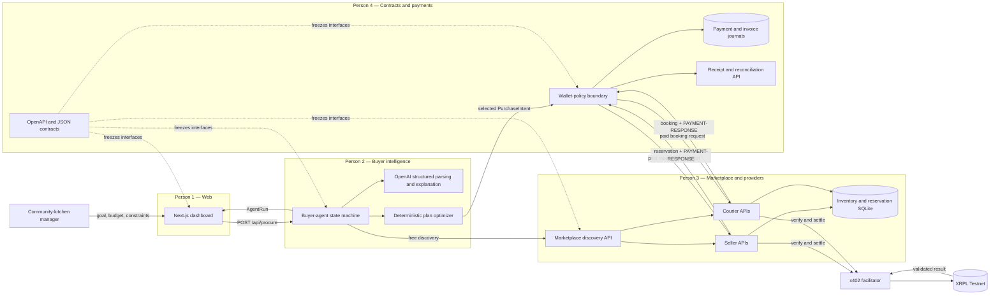
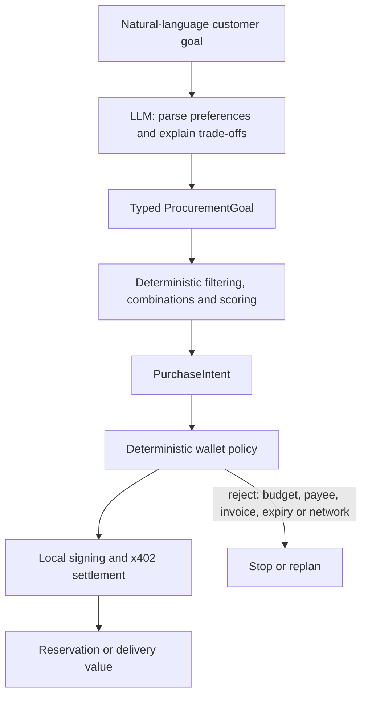

# SurplusFlow System Architecture

Status: **Contract Freeze v1.0.0**

This is the target hackathon architecture. Components with unfinished teammate
implementations remain contract-backed, so each contributor can work without
sharing internal files.

## Component and ownership view



## AI and deterministic boundary



The LLM never receives a wallet seed and never builds or signs a transaction.
It contributes interpretation and explanation. Deterministic code owns food
safety, expiry, quantity, price arithmetic, provider allowlists, spending caps,
invoice matching, idempotency, signing, and settlement verification.

## Trust boundaries

| Boundary | Permitted data | Prohibited data |
| --- | --- | --- |
| Browser → buyer agent | Goal, budget, dietary needs, deadline | Wallet seed, signed transaction blob |
| Buyer agent → payment package | Frozen `PurchaseIntent`, run spend | Raw LLM prose as authorization |
| Payment package → provider | Request body, idempotency key, x402 proof | Buyer seed |
| Provider → facilitator | Payment payload and advertised requirements | Private customer or dietary details beyond the opaque invoice |
| XRPL | Payment, public accounts, SourceTag, opaque invoice binding | Personal data, food details, delivery address |

## Commercial loop

```text
Customer requests meals
  → buyer agent discovers food and delivery supply
  → optimizer selects an authorized combination
  → payment boundary purchases reservations through x402
  → XRPL validates settlement
  → sellers and courier return exclusive reservations/bookings
  → dashboard shows fulfilled quantity, remaining budget and explorer links
```

Removing the AI would return the user to manual multi-provider coordination.
Removing the machine-payment boundary would prevent the agent from securing
time-sensitive inventory immediately after deciding.

## Persistence ownership

- Person 3 owns offer, inventory, reservation, booking, and provider reputation
  data in the marketplace database.
- Person 4 owns x402 invoice state, idempotent paid-response replay, payment
  attempts, transaction hashes, and reconciliation status.
- Person 2 owns agent-run and decision state through its service interface.
- Person 1 owns no secrets and treats backend state as server-owned.

## Failure paths shown in the demo

1. An incompatible or expired food offer is rejected before payment.
2. One selected provider becomes unavailable, causing the agent to replan.
3. A policy mismatch prevents signing.
4. A pre-signature network failure may retry using the same idempotency key.
5. A post-signature unknown outcome is reconciled by transaction hash and is
   never blindly resubmitted.
6. A lost successful HTTP response is replayed from the provider response store
   without performing another settlement.
